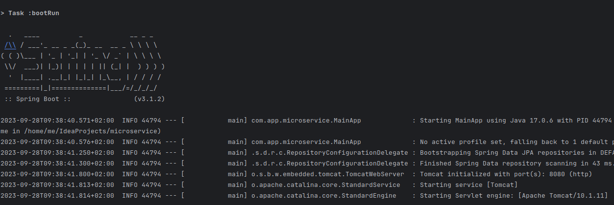
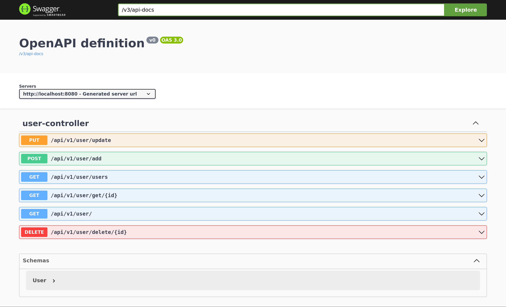
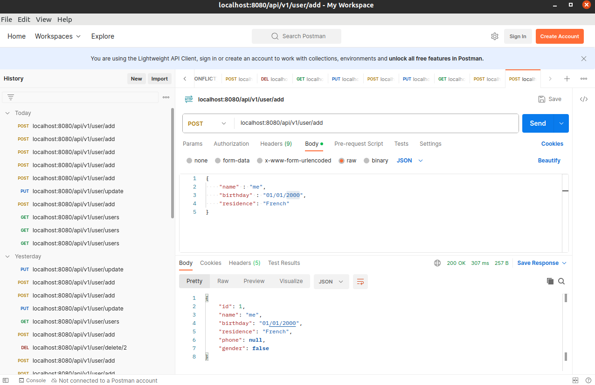

# Introduction
Welcome, this document describes the microservice application.

## running the program

To run the program, just execute the MainApp class.
First navigate to the project directory.
```bash
cd microservice
```
Run the following gradle command.
```java
./gradlew bootRun
```
Make sure the http port 8080 is free.

Normally, logs console will be displayed as below, if not error was encountered.  




# Swagger
This microservice comes with a Swagger UI. Thus, it can be easily tested.

When the application is running, the Swagger UI can be accessed via the [link](http://localhost:8080/swagger-ui/index.html).



# Documentation
The javadoc can be found in the folder ./docs. It describes the different APIs exposed by this application.
It can be rebuilt with using the following commandline.
```shell
 javadoc -d "./docs" --source-path "src/main/java" -subpackages com.app.microservice

```
# Unit-Test

Functional and Integration tests can be found in the folder ./src/test


# Postman testing


This microservice was also tested using postman, below is an example of the tested requests.




